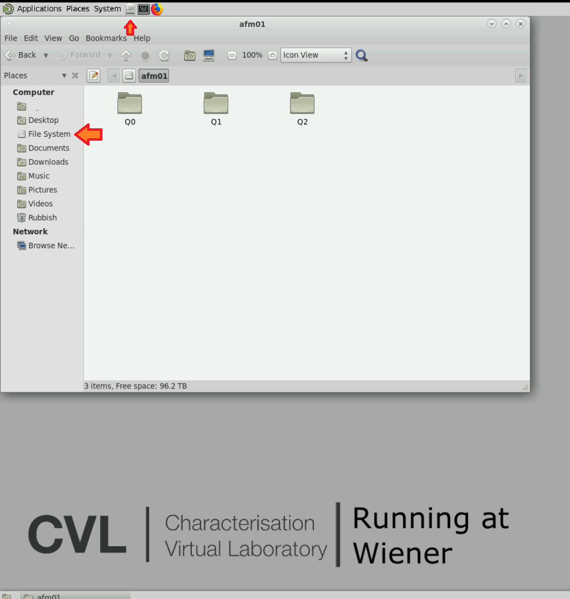

How to login and use CVL on Wiener tutorial.

Last updated 10 August 2020

Please note that desktops on Wiener are still in *Beta mode* and we appreciate your feedback to improve the system. For any enquiries or to report issues please send an email to QRISCloud helpdesk [support *at*  qriscloud.org.au](mailto:support@qriscloud.org.au).

## Get an account on Wiener
If you have University of Queensland credentials and have the need to use infrastructure resources such as HPC and GPUs you can request an account on Wiener.

1. Get a Wiener account by sending an email to [helpdesk QBI IT](mailto:helpdesk@qbi.uq.edu.au). The email should outline a short description, including your need to access CVL on Wiener, and request to be added to the **wiener-cvl** group.
    If you want to read more about Wiener read The University of Queensland Research Computing Centre (UQ RCC) [Wiener guide](https://rcc.uq.edu.au/wiener){:target="_blank"}.
2. If you have projects on UQRDM, you can also request to access your **'Q'** collections via Wiener, by sending your username and collections' ids. Note, only connections that are marked as HPC usage in your application can be accessible, those will start with a QXXXX.

## Access CVL @ wiener

Once your account and permissions are ready, you can log in to Wiener.

1. We recommend using Chrome, and navegate to [https://desktop.cvl.org.au](https://desktop.cvl.org.au){:target="_blank"}. From the drowpdown "Select remote system", select *CVL@Wiener (BETA)*.
   

      
Click to see the screenshot

      
   

1. Click the blue button "LOGIN"
1. Authorisation required for this step. When asked, please login with your institutional credentials through AAF. You can check the box to remember your details, or it will ask you every time you login.
1. Then, click the blue button "I AGREE" to share your email to the system
1. Once you see a new window called "Strudel Web" Click on **WIENER**
    

       
Click to see the screenshot

        
    

1. Then, to launch a new desktop, you can use the defaults, or modify memory and hours. Your desktop will close after the time has reach its limit. The maximum you can request is 24 hours. Click on *Launch* and wait. You should see a message at the bottom right "Desktop #XXX Launched Successfully". Note, ou can only run one desktop at the time.
    

      
Click to see the screenshot

      
    

1. A desktop will start when state is checked, and the **Show Desktop** is available
   

     
Click to see the screenshot

     
   

1. A new tab will open and you might see shortly a message that says "Connecting to guacamole"
1. Once you see the CVL on Wiener logo you are ready to use the tools.
1. When you finish using the tools you need, you can shut down the desktop vis the top menu > System Shut Down. It will double check with a question, click on Shut down and close the tab
   

     
Click to see the screenshot

    
    

### Open Software Applications on the CVL@wiener

- **To access data collections** via Wiener go to File System and then click on afm01 and then look for your QXXX (look for the number of your project).
  

    
Click to see the screenshot

    
  

  IF you can not access your collection, you need to send a request to [helpdesk QBI IT](mailto:helpdesk@qbi.uq.edu.au) stating your need to access UQRDM collections via the CVL@Wiener, your user name and collection's ID.
- **To open FIJI**, go to top menu Applications> CVL Neuroimagig, CVL Fiji
    

      
Click to see the screenshot

      
       
      
    

- **To open the Terminal**, go to top menu click on the black box
    

      
Click to see the screenshot

      

    

## Contact details
For any inquires, feedback, software requests and to report user experience issues about the CVL@Wiener, please send an email to [QRISCloud helpdesk](mailto:support@qriscloud.org.au).

- Connection errors are a known issue. If this pop-up shows.
    

      
Click to see the screenshot

      
    

Try clicking on the logout button, sometimes the cache needs to be cleared, it won’t kill your desktop session, just reset the browser cache. If you see this multiple times in one session please send an email to helpdesk.

Last updated 10 August 2020
